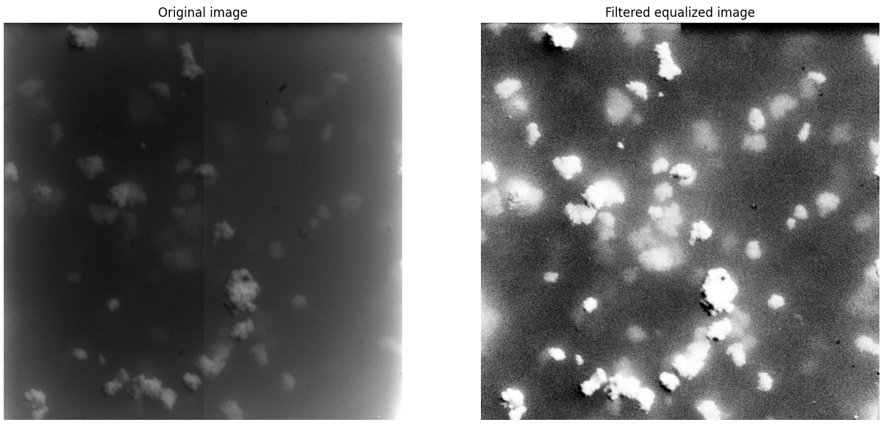
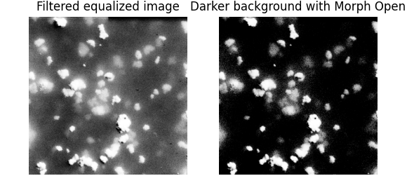
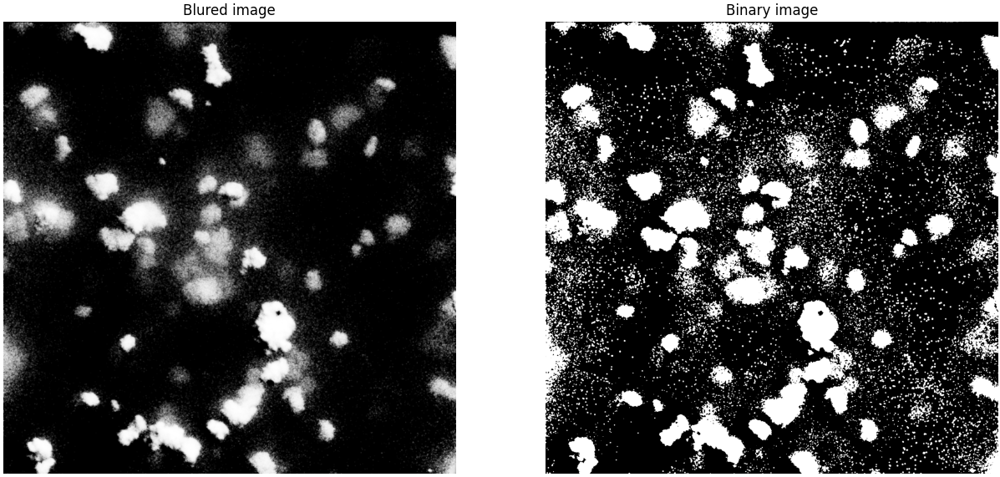
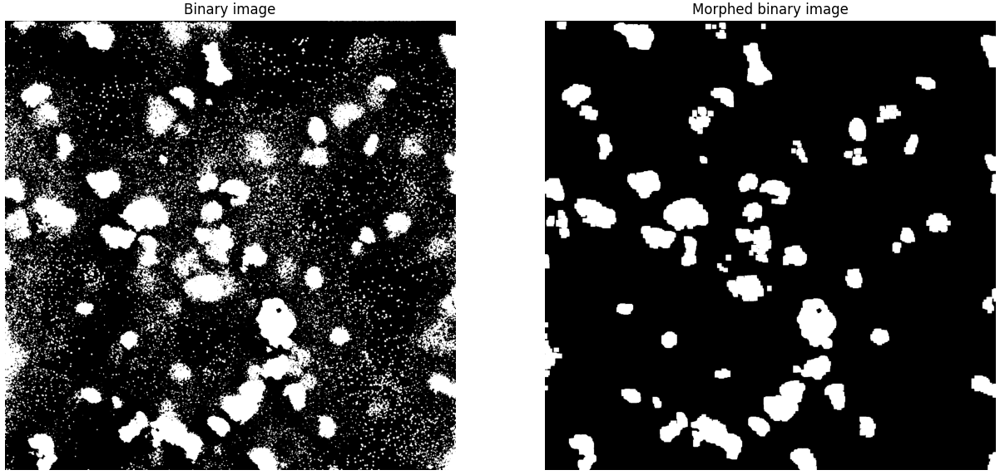
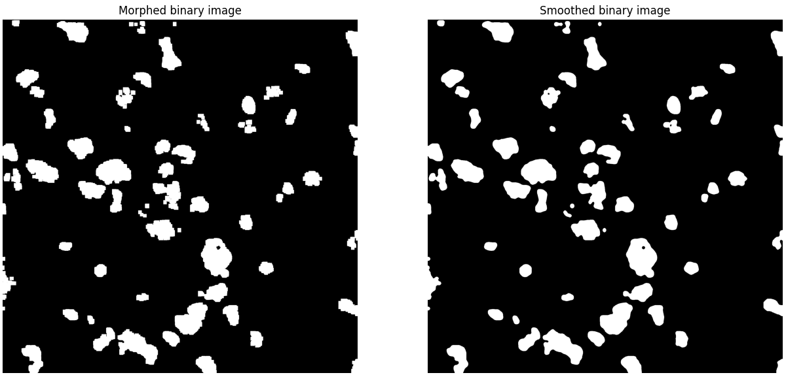
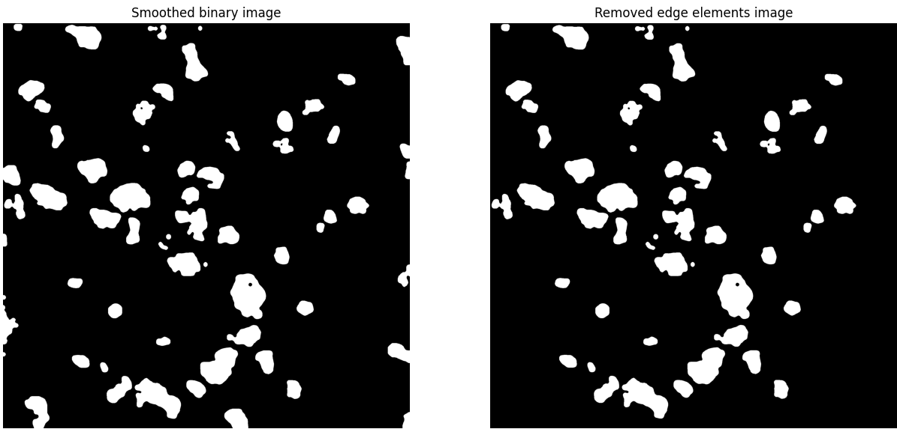
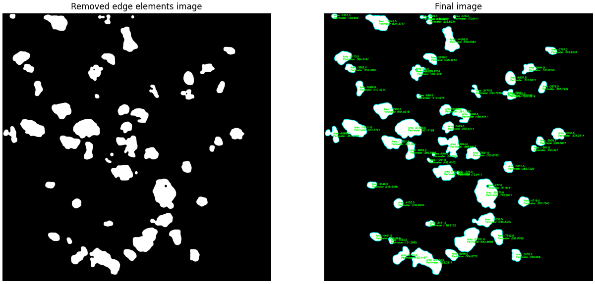
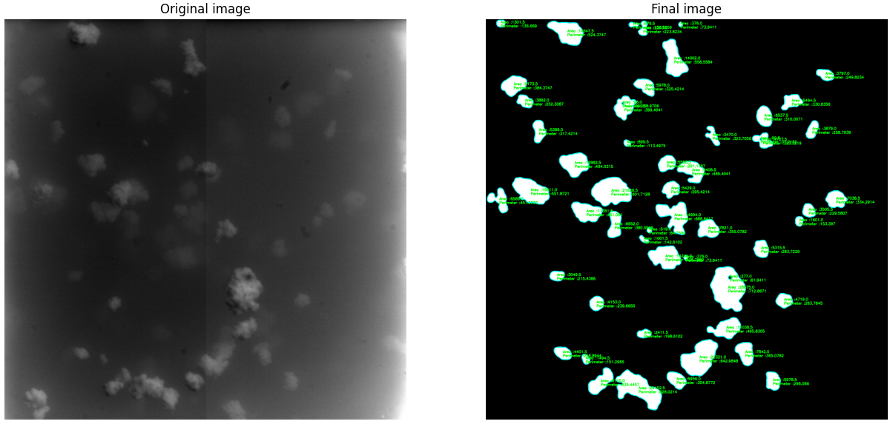

= Rapport miniprojet traitement d'image
:sectnums:

== Introduction
Le but de ce projet étant de connaitre la forme des agrégats présents sur les photos. Pour cela, plusieurs étapes ont été nécessaires : +
- Nettoyer les photos pour enlever les problèmes de luminosité non uniforme +
- Séparer les agrégats pour les avoir en blanc sur fond noir +
- Calculer leur périmètre et leur air afin de connaitre leur forme

Les étapes suivantes ainsi que les résultats obtenus sont décrit dans ce rapport

== Travail réalisé
=== Nettoyage des imperfections du capteur
Afin de d'obtenir des images propres en limitant les problèmes de luminosité et les imperfections du capteur, j'ai commencé par appliquer un filter à l'image qui est composée de la somme de toutes les images, divisé par leur nombre. Cela permet d'obtenir le filtre suivant qui fait ressortir les imperfections communes à toutes les images :

Filtre de luminosité +
image:Images rapport/luminosityFilter.bmp[width=300]

Pour accélérer le script python, ce filtre est calculé une première fois puis enregistré. Après, le filtre est récupéré comme une image. L'image est ensuite éclairé avec `equalize_hist` afin de faire mieux ressortir les contrasts et éliminer les extremes.

Le filtre et l'éclairage font l'effet suivant :



=== Enlever le bruit de fond
Comme one peut le voir sur l'image précédente, l'arrière-plan de la photo est encore très bruité. Pour rendre le font plus noire et enlever les pixels solitaires, j'ai appliqué le filtre morphologique `MORPH_OPEN` de `cv2`. Ainsi, les agrégats se séparent bien du fond.



=== Application d'un flou gaussien
Si nous zoomons sur l'image précédente, nous pouvons voir que les agrégats sont composés de pixels très clairs et de pixels très foncés. Pour éviter que le seuil servant à la binarisation de l'image laisse la moitié des pixels des agrégats en noir, j'applique un léger filtre gaussien pour uniformiser les pixels :
`ski.filters.gaussian(morphedImage,1)`

=== Binarisation de l'image
L'étape d'après consiste à séparer les agrégats du fond. Or, certains agrégats sont très clairs alors que d'autres sont plutôt sombre. Pour que tous les agrégats soient détectés, j'ai appliqué un seuil local sur une tuille de la taille d'un agrégat moyen avec la commande suivante :
```py
threshold=ski.filters.threshold_local(bluedImage,301)
binaryImage = bluedImage>threshold
```
Cela donne le résultat suivant :



=== Nettoyage image binaire
Afin d'enlever les pixels solitaires sur l'image binarisé, j'ai de nouveau appliqué une opération morphologique avec
```
cv2.morphologyEx(binaryImage, cv2.MORPH_OPEN, np.ones((20, 20), np.uint8))
```

Cela donne le résultat suivant :



=== Lissage image binaire
Puisque que la detection de contour fonctionne mieux avec des contours continus, j'ai appliqué un filtre median qui lisse les agrégats. Cela aussi l'avantage de refermer la plupart des trous à l'intérieur, ce qui évite de compter de faux contours.
`medianImage = ski.filters.median(morphedBinaryImage,ski.morphology.disk(10))`



=== Suppressions des agrégats sur les bords
Afin d'avoir une valeur de juste de la taille des agrégats, il faut enlever ceux sur le tour. Pour cela, il suffit de créer une bordure de deux pixels sur tout le tour et d'enlever tout ce qui touche cette bordure avec le code suivant :
```py
pad = cv2.copyMakeBorder(image, 1, 1, 1, 1, cv2.BORDER_CONSTANT, value=255)
h, w = pad.shape
mask = np.zeros([h + 2, w + 2], np.uint8)
 img_floodfill = cv2.floodFill(pad, mask, (0, 0), 0, (5), (0), flags=8)[1]
```
Cela donne le résultat suivant :



=== Calcul de l'air et du périmètre
Une fois l'image proprement traitée, détecter les contours est un jeu d'enfant avec `cv2.findContours`. La valeur du périmètre et de l'air de chaque agrégat est sauvegardé dans un document texte afin de pouvoir la récupérer pour tracer l'histogramme. La détection de contour donne cela :



=== Comparaison finale
Ainsi, l'ensemble des transformations précédentes permettent de passer de l'image originale à l'image finale




== A propos des codes

=== Description et utilisation du code
**preprocessing.py :** Ce code nettoie les images, enregistre la version nettoyée dans un dossier et les aires et les périmètres des agrégats sous forme d'un document texte dans un autre.

Il prend en argument sous forme de variable au sommet du fichier le dossier où se trouvent les images à traiter, le fichier dans lequel mettre les images traitées et le fichier dans lequel mettre les documents textes.

De base, il est configuré pour traiter toutes les images du fichier d'entrée. Pour le tester, je conseille donc de mettre seulement quelques images dans le fichier d'entrée. Pour qu'il affiche les étapes intermediates, il suffit de décommenter le `plt.show()` à la fin de la boucle for.

**drawHistograms.py :** Ce code lit l'ensemble des fichiers contenant l'air et le périmètre et trace les histogrammes avec. Il prend en entrée le fichier contenant les documents textes

Afin de faciliter son utilisation, le code est fourni avec le filtre,et le résultat du traitement d'une image


=== Le temps d'exécution
Le plus grand point négatif de ce code est son temps d'exécution. Ainsi, le nombre d'étapes pourrait paraitre trop grand pour un traitement si simple. Cependant, pour un temps d'exécution total de 9 secondes, 7 secondes sont dues au seuil local et une au filtrage par filtre médian. Ces deux étapes sont absolument essentielles pour avec une bonne segmentation et une bonne detection de contours. L'ensemble des autres étapes ne représentant qu'une seconde d'exécution, elles valent le coup au vu de l'amélioration de qualité apportée.

== Résultats

Mettre les histogrammes ici